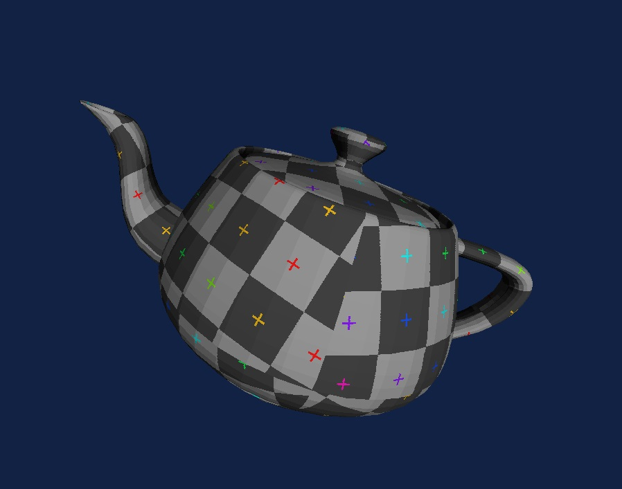

### [Go to Demo](https://nkappler.github.io/rasterizer/)

# Software Rasterizer

This is a simple realtime 3D renderer (rasterizer) which is entirely software-based. This means all the calculations are done in JavaScript, without using WebGL or any other hardware acceleration or in other words, it runs on your processor (on a single core) instead of your graphics card.

Don't be fooled by the performance, graphics cards are designed to do this kind of work very efficiently and I am surprised how well this works in the browser. JavaScript is not known for its speed, but I was able to find some optimizations that make this work quite well, although with more time there would be a few things I could still improve.

This project is based on this [wonderful video series from David Barr on YouTube](https://www.youtube.com/watch?v=ih20l3pJoeU), although I've implemented some optimizations to make it run faster in the browser.